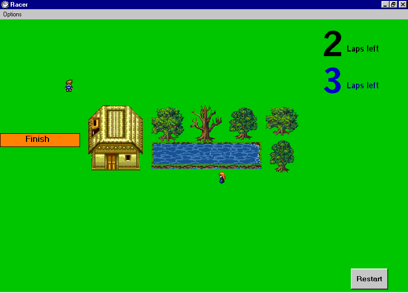



## Racer

### Description

This is a challanging game and an upadated version of the fast button pushing game. In

order to win you must rapidly press the arrow

keys as fast as possible. There are two tracks,

passwords and five skill levels.
 
### More Info
 

             |
---                |---
**Submitted On**   |2001-05-18 14:23:54
**By**             |[Matthew Stride](https://github.com/Planet-Source-Code/PSCIndex/blob/master/ByAuthor/matthew-stride.md)
**Level**          |Beginner
**User Rating**    |4.9 (34 globes from 7 users)
**Compatibility**  |VB 5\.0, VB 6\.0
**Category**       |[Games](https://github.com/Planet-Source-Code/PSCIndex/blob/master/ByCategory/games__1-38.md)
**World**          |[Visual Basic](https://github.com/Planet-Source-Code/PSCIndex/blob/master/ByWorld/visual-basic.md)
**Archive File**   |[Racer197395182001\.zip](https://github.com/Planet-Source-Code/matthew-stride-racer__1-23254/archive/master.zip)

